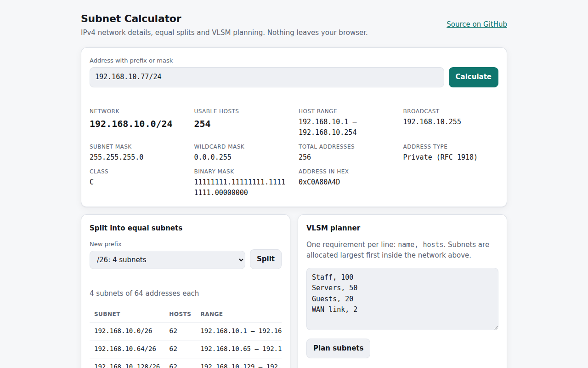

# Subnet Calculator

[](https://github.com/umer-78/subnet-calculator/actions/workflows/ci.yml)


**Live demo:** https://umer-78.github.io/subnet-calculator/

An IPv4 subnet calculator for network engineers and students (CCNA, Packet Tracer
labs). No framework, no build step — everything runs in the browser.



## Features

- **Network details** for any address: network, broadcast, host range, usable
  hosts, mask, wildcard, binary mask, class and address type (private, CGNAT,
  loopback, documentation, …)
- Accepts `10.0.0.5/24`, `10.0.0.5 255.255.255.0` or `10.0.0.5/255.255.255.0`
- Correct edge cases: `/31` point-to-point links (RFC 3021) and `/32` host routes
- **Equal split** into 2ⁿ subnets
- **VLSM planner**: give it named host requirements and it packs them
  largest-first without overlap, reporting what is left
- **Route summarization**: merge a list of networks into the fewest
  equivalent CIDRs, plus the smallest single supernet covering them
- Shareable links: the address is kept in the URL hash
- Light and dark theme, keyboard accessible, works on phones

## Run locally

```bash
git clone https://github.com/umer-78/subnet-calculator.git
cd subnet-calculator
python3 -m http.server 8080      # or: npm start
# open http://localhost:8080
```

ES modules need to be served over HTTP. Opening `index.html` directly from disk will not work.

## Tests

The maths lives in [`src/ipv4.js`](src/ipv4.js) with no DOM access, so it is tested with Node's built-in runner:

```bash
node --test
```

## How VLSM allocation works

1. Each requirement gets the smallest prefix that fits it (`hosts + 2`
   addresses, or `/31` for 2 hosts and `/32` for 1).
2. Requirements are sorted largest first.
3. Each block is placed at the next address aligned to its size, so blocks
   never overlap and fragmentation stays low.
4. If a block would run past the parent network, the planner reports which requirement did not fit.

## License

[MIT](LICENSE)
